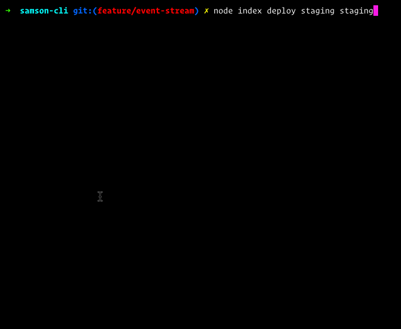

# Samson CLI
Command line utility to manage deploys in Zendesk's Samson



## Requirements
`git` and Node.js >=4 with `npm`.

## How to install
Just install the `samson-cli` globally.
```
npm install -g samson-cli
```

## Configuration
You should create a `samsonrc.json` file in each of your project directories. `samson` will look for it when you run the tool. The file should have this shape:

```json
{                                                                             
  "url": "http://my-samson-url.com",                              
  "project": "myProjectName",                                                        
  "auth": "<authentication cookie>"                                            
}  
```

The `auth` key expects the value of your Samson session cookie. We still don't have a better authentication system (perhaps based in a Samson user token) due to Samson API limitations.

## Usage
```
samson <command> [options...]
```

## Commands

### `deploy`
Performs a deploy of a branch or tag to a stage.

Syntax:
```
samson deploy <stage> <reference>
```

Where `stage` is a valid stage (see `samson stages`) and `reference` is a branch, tag or commit SHA.

Example:
```
samson deploy staging master
```

### `deploys`
Prints the last 15 deploys.

Syntax:
```
samson deploys
```

### `builds`
Prints the last builds.

Syntax:
```
samson builds
```

### `stages`
Prints the configured stages.

Syntax:
```
samson stages
```

## To do
- [ ] Authenticate using Samson token instead of the session cookie
- [ ] Better help and readme
- [ ] Show deploy output
- [ ] Be able to specify a custom `samsonrc.json`
- [ ] Fail when no `samsonrc.json` is found
- [ ] Manage configuration defaults
